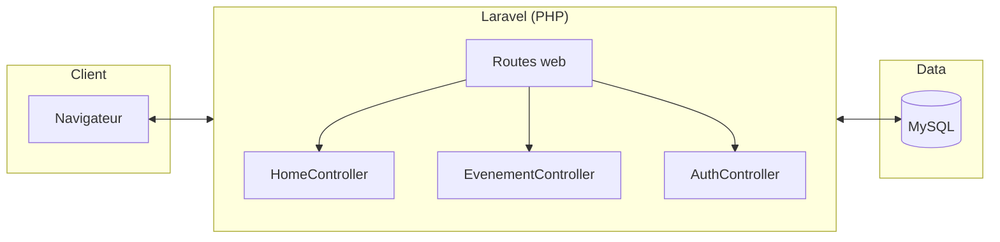
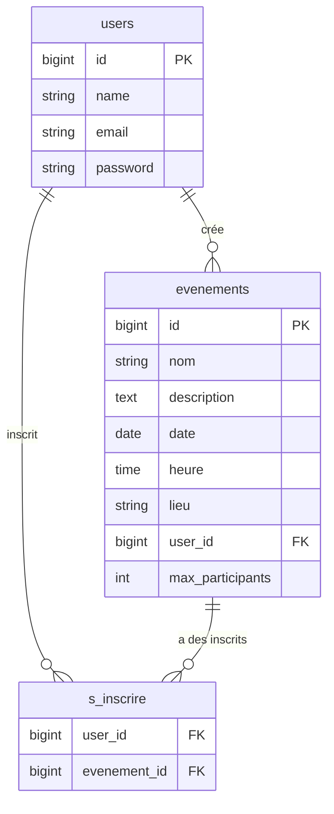

# Document technique — WhatsAround

## Architecture

- **Backend :** Laravel (PHP 8.2), MVC, Eloquent.
- **Base de données :** MySQL 8. Tables : users, evenements, s_inscrire (pivot), sessions.
- **Authentification :** sessions Laravel, middleware `auth`.

### Schéma simplifié





## Installation

### Sans Docker

```bash
composer install
cp .env.example .env
php artisan key:generate
# Configurer DB_* dans .env
php artisan migrate
php artisan serve
```

### Avec Docker

```bash
docker-compose up --build
# L'app est sur http://localhost:8000
# MySQL sur localhost:3306 (user: whatsaround, pass: secret)
```

## Déploiement

Le Dockerfile expose le serveur Artisan sur le port 8000. En production, prévoir un reverse proxy (nginx) ou utiliser `php artisan serve` derrière un proxy.

## Notifications

En cas de **modification** ou d’**annulation** d’un événement, un email est envoyé à chaque inscrit (via `App\Mail\EvenementModifie` et `App\Mail\EvenementAnnule`). Configurer `MAIL_*` dans `.env` pour un envoi réel ; par défaut (`MAIL_MAILER=log`), les messages sont écrits dans les logs.

## Pipeline et conteneurisation

- **CI :** GitHub Actions (voir `.github/workflows/ci.yml`) — tests sur chaque push vers `main` et `develop`.
- **Conteneurisation :** `docker-compose` lance l’app PHP et MySQL ; le Dockerfile peut être étendu pour la production.
